# Elixir Systems

* [View Orders](#view-orders)
* [Search Orders](#search-orders)
* [Process (print) Orders](#process-print-orders)
* [Scan Barcodes](#scan-barcodes)
* [Create an Order](#create-an-order)
* [Reorder](#reorder)
* [Customer Services](#customer-services)
* [View Products](#view-products)

The initial splash screen (known as Ground Control) displays the following six operations:

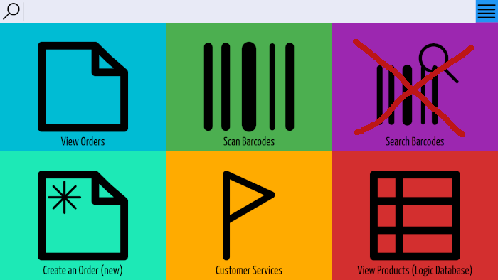

*** **_Nb. Search Barcodes is not used_** ***

A further dozen or so operations are available in the drop-down menu:


## View Orders

Displays orders that require processing in our system. These come from different platforms:

* Amazon
* Ebay
* Elixir Website
* onBuy

The channels are only relevant to Ebay. We currently have 3 different Ebay accounts: Elixir, Floorworld & Prosalt. So the `Channel` column value displays which Ebay account the order is from. All non Ebay orders are automatically assigned a value of 'Elixir'.

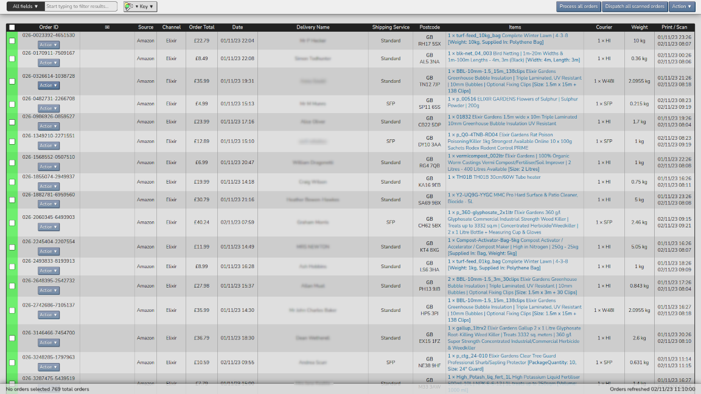

### Invoice Logos

The channel values affect which logos are displayed at the top of invoices:

Channel = Elixir 
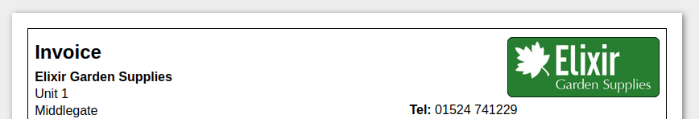

| Channel = Floorworld | Channel = Prosalt |
| ---------------- | ------------- |
|  | 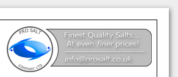 |


Orders with a message, display an envelope icon (mouseover displays the message). Several operations relevant to an order can be selected by hovering over the `Actions` button:

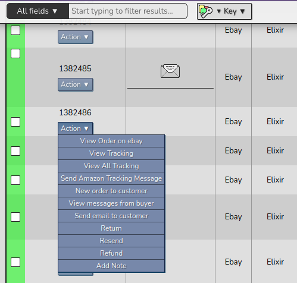

The `Action` menu in the top right has several batch operations that can be used on multiple orders simultaneously.

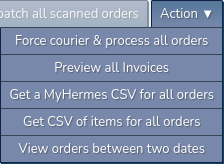

The contents of this menu has 2 states. If any individual orders are checked it displays the following:

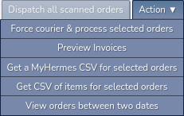


## Search Orders

There are a number of issues with the current search.

Amazon order IDs use the following format (each x being a number): xxx-xxxxxxx-xxxxxxx (eg. 026-0965816-1453949)

Ebay Elixir uses a total of 7 digits (eg. 1385884), Ebay Floorworld: 'FW-' followed by 4 digits (eg. FW-3089), Ebay Prosalt: 'PS-' followed by 5 digits

The website uses 6 digits.

Onbuy is inconsistent. Apart from starting with the letter 'T', they can be all numbers or a mixture of numbers and letters. They also vary between 6 and 7 characters in length.


The issue arises when searching website order IDs. The system does not just look for an exact match (full string), so entering 6 digits for a website order also returns matching results for Amazon and Ebay Elixir orders. In addition to this, the system does not allow barcodes to be searched.

My solution for this is to have search default to querying Ebay Elixir and Website orders. A search string will need to contain a dash to query Amazon. A number with a leading dash will act on the last segment of the Amazon order ID. Eg. '-305633' would return:

```
202-0605471-3056336
205-0873569-3056331 
026-4923194-3056333 
etc.
```

The solution for searching barcodes is to enter a leading 'b': eg. `b41219756`

<!-- SS15 6ED -->


## Process (print) Orders

The process orders button (near the `Action` menu) is used to print order invoices.

The text displayed on the `Process all orders` button is also dynamic:  

  

Checked orders result in `Process selected orders` being displayed:  


The `Action` menu also has a preview invoices option (`Preview all Invoices` / `Preview selected Invoices`) that allows all historic order invoices to be previewed. Invoices are displayed without their original labels, as in the following example:

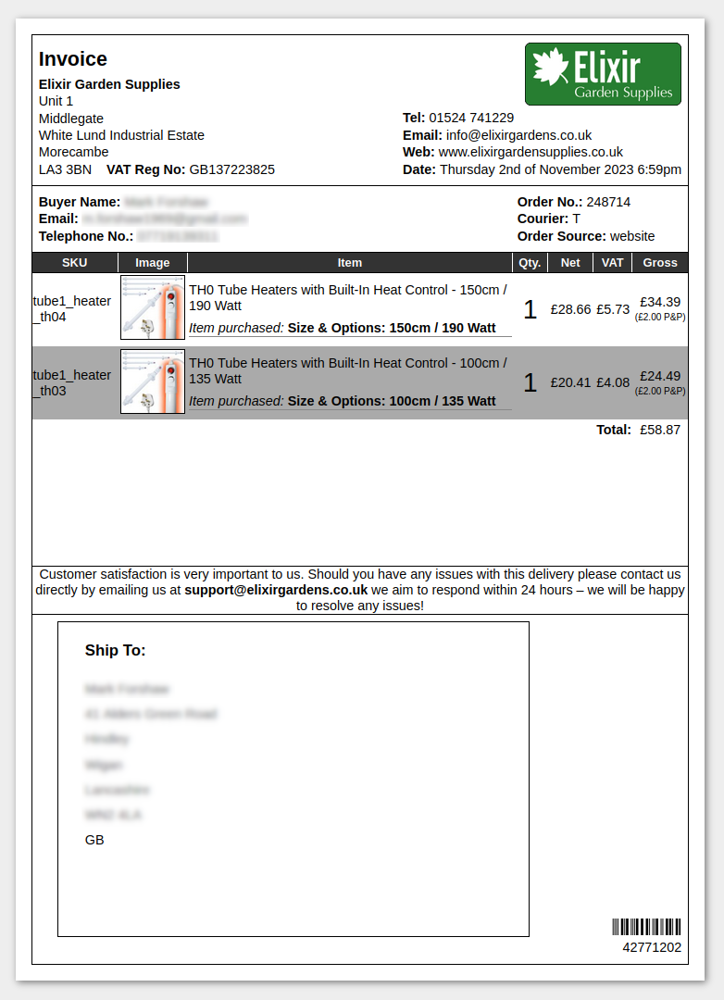

### Legend: Colour Codes / Courier Codes 

The 'Colour Codes', in the `Key` drop-down, explains the meaning of the colours on the far left of the order's row. In the example shown, the first 2 orders are green *"Order has been marked and is ready to be dispatched"*, followed by red *"Order has been processed but not yet marked"* and grey *"Order is ready to be processed, unbarcoded"*.

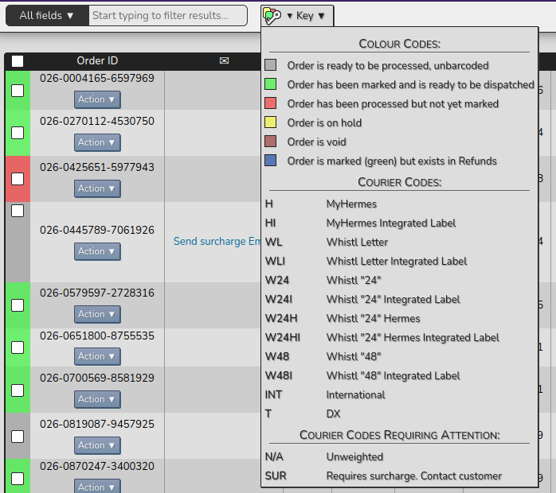

Final notes: The product descriptions in the 'Items' column are hyperlinks that open the product on relevant platform (Amazon, eBay etc) in a new tab.


## Scan Barcodes

The barcodes DB table stores the status of the order:

* GENERATED (displays as red in View Orders)
* MARKED (green)
* HOLD (yellow)
* VOID (brown)

Nb. grey are orders that don't yet have a barcode

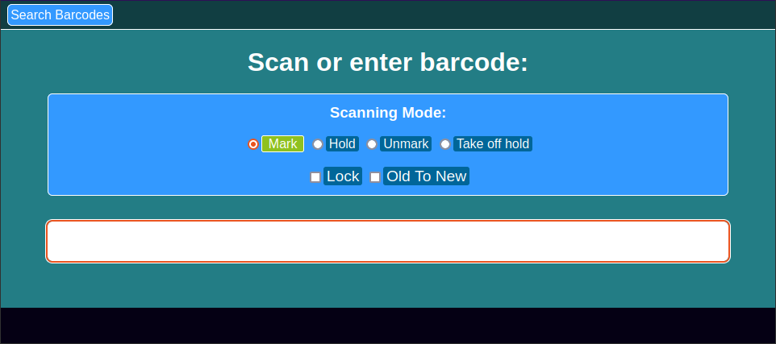

The barcode scanner can only input barcodes if the page is in focus (green background). To signal this, the background turns red when focus is lost.

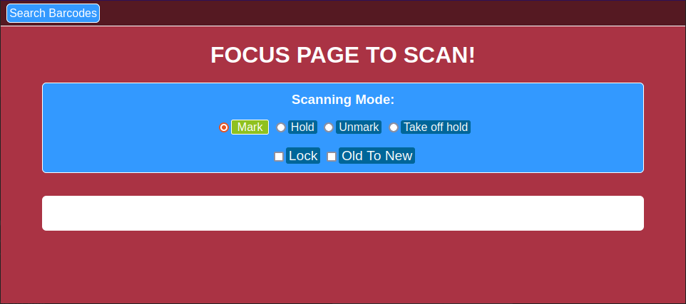


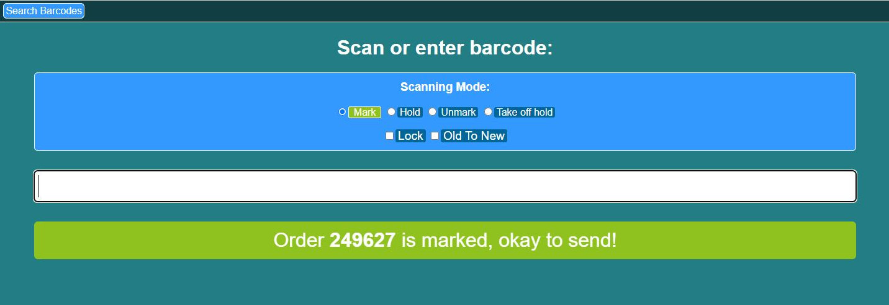

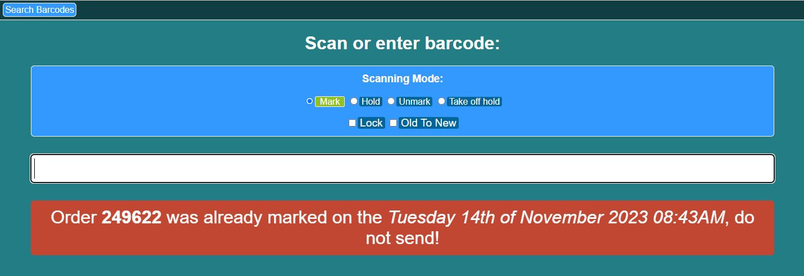


## Create an Order

The **Create an Order** page actually has 2 states. The default (below) is the one that appears when accessed from the **Ground Control** page. The second is **Reorder**, and this appears when accessed from the `New order to customer` option in the `Action` drop-down menu (View Orders) - more on this later.

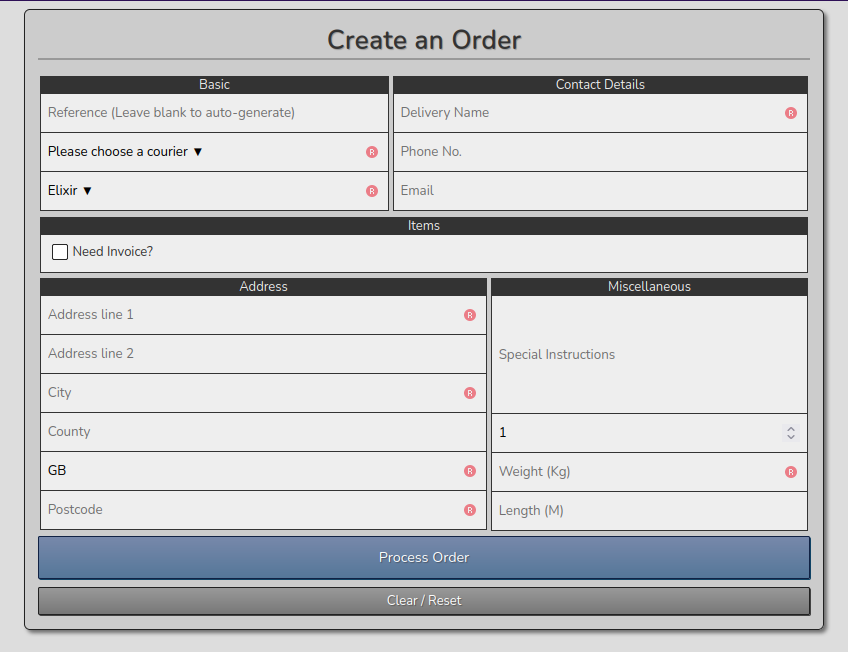

The `Please choose a courier` drop-down options are the same as the `Courier Codes` in the `Key` drop-down on the `View Orders` page:

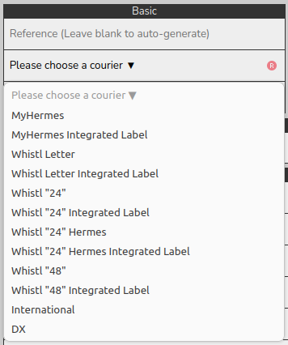

The drop-down below this displays the 3 channel options (Elixir, Floorworld & Prosalt) - displays the correct invoice logo:  

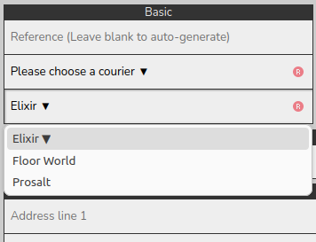

The **Items** section displays the input fields (when `Need Invoice?` checkbox selected) to add items to an order:  

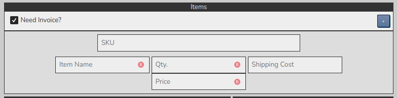

## Reorder

As mentioned earlier, when accessed via the `New order to customer` link, it displays as a `Reorder` page. Basically, it prepopulates the form fields with existing customer data:  

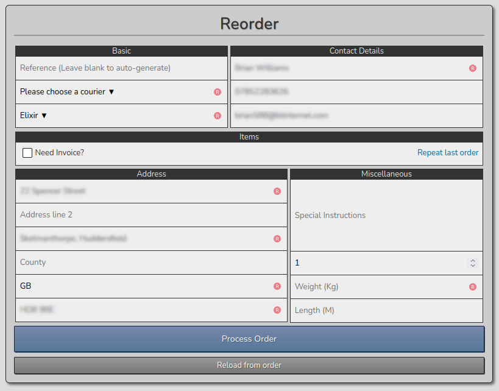

It also displays a`Repeat last order` link in the `Items` section. When clicked, the order's items are prepopulated:  

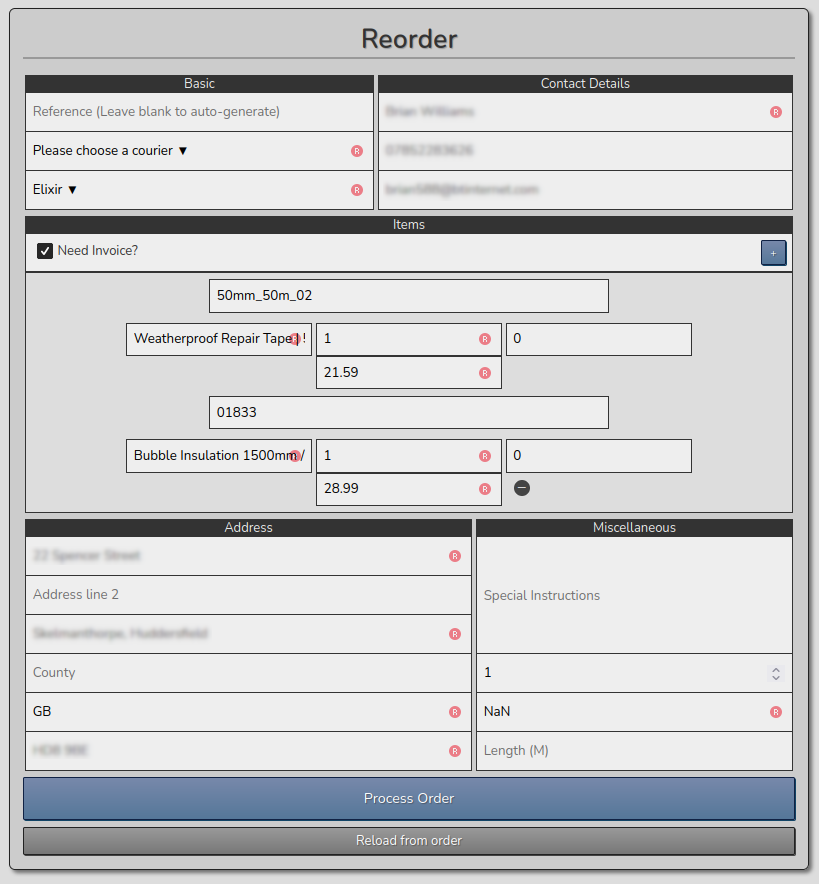

## Customer Services

Customer services is a separate system to the Elixir System documented so far. The Elixir System consists of 100+ PHP and JavaScript files, and a dozen SQLite databases running on a PHP 5.6 server. Customer services runs on a different server. It's a Django / Vue JS system, running on a Linux OS. Being a separate system, I'm not going to discuss it any further here.

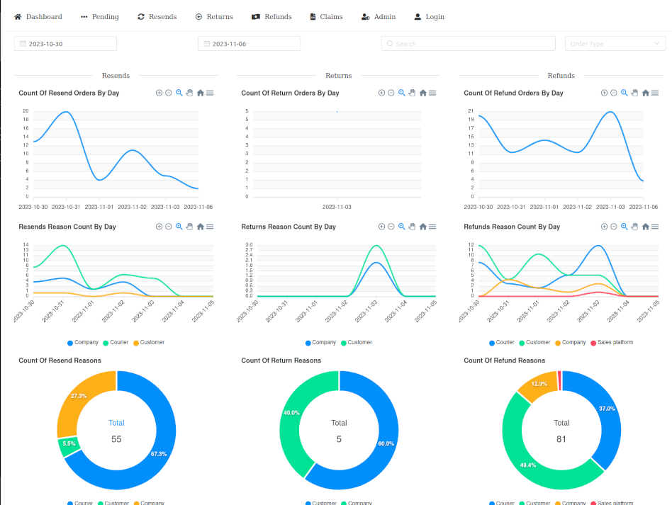

## View Products

Displays the 'products' database contents. The database stores the 'weight' and 'length' of every 'sku'. This is used to calculate the correct shipping for any given order.

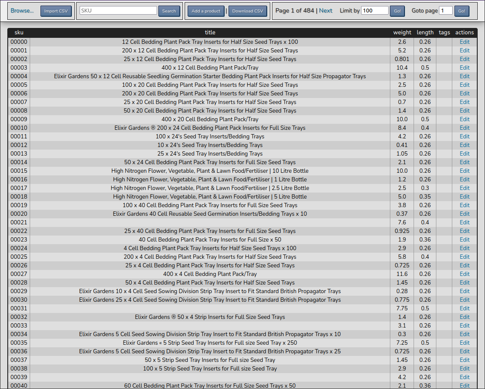

New records can be added by clicking the  `Add a product` button. This open the add product modal box. Records can also be modified by clicking `Edit` in the `actions` column. This opens the previous modal box, only prepopulated.

| Add Product | Edit Product |
| ----------- | ------------ |
| 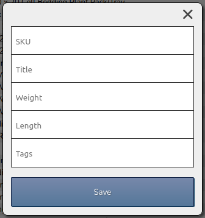 | 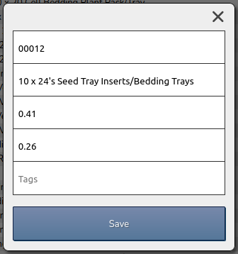 |

The 'SKU' search field just displays the 1 sku entered. Entering '***3FT_TUBE-HEATER***', for example, displays the following:

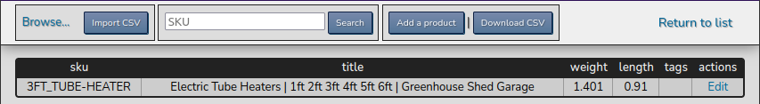

NOTE: Search only works if the exact case and full SKU is entered (a short-sight that needs changing). Neither of the following return any records:

* `heater`
* `3ft_tube-heater`

