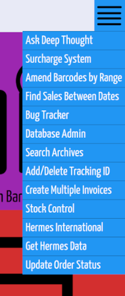

# Elixir Systems

* [View Orders](#view-orders)

The initial splash screen (known as Ground Control) displays the following six operations:

A further dozen or so operations are available in the drop-down menu:

## View Orders

Orders with a message, display an envelope icon (mouseover displays the message). Several operations relevant to an order can be selected by hovering over the `Actions` button:

The `Action` menu in the top right has several batch operations that can be used on multiple orders simultaneously.

The 'Colour Codes', in the `Key` drop-down, explains the meaning of the colours on the far left of the order's row. In the example shown, the majority are grey (white) "Order is ready to be processed, unbarcoded" and red "Order has been processed but not yet marked". The green order (026-1324051-2893122) indicates that "Order has been marked and is ready to be dispatched".

