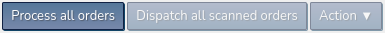

# Elixir Systems

* [View Orders](#view-orders)
* [Scan Barcodes](#scan-barcodes)
* [Create an Order](#create-an-order)
* [Reorder](#reorder)
* [Invoices](#invoice)

The initial splash screen (known as Ground Control) displays the following six operations:

*** **_Nb. Search Barcodes is not used_** ***

A further dozen or so operations are available in the drop-down menu:

## View Orders

Displays orders that require processing in our system. These come from different platforms:

* Amazon
* Ebay
* Elixir Website
* onBuy

The channels are only relevant to Ebay. We currently have 3 different Ebay accounts: Elixir, Floorworld & Prosalt. So the `Channel` column value displays which Ebay account the order is from. All non Ebay orders are automatically assigned a value of 'Elixir'.

The channel values affect which logos are displayed at the top of invoices:

Elixir logo:  

Floorworld logo:  

Prosalt logo:  

Orders with a message, display an envelope icon (mouseover displays the message). Several operations relevant to an order can be selected by hovering over the `Actions` button:

The `Action` menu in the top right has several batch operations that can be used on multiple orders simultaneously.

The contents of this menu has 2 states. If any individual orders are checked it displays the following:

The text displayed on the `Process all orders` button (near the `Action` menu)  is also dynamic. Checked orders result in `Process selected orders` being displayed: 

The 'Colour Codes', in the `Key` drop-down, explains the meaning of the colours on the far left of the order's row. In the example shown, the first 2 orders are green *"Order has been marked and is ready to be dispatched"*, followed by red *"Order has been processed but not yet marked"* and grey *"Order is ready to be processed, unbarcoded"*.

Final notes: The product descriptions in the 'Items' column are hyperlinks that open the product on relevant platform (Amazon, eBay etc) in a new tab.

## Scan Barcodes

The barcodes DB table stores the status of the order:

* GENERATED (displays as red in View Orders)
* MARKED (green)
* VOID (brown)
* HOLD (yellow)

Nb. grey are orders that don't yet have a barcode

The barcode scanner can only input barcodes if the page is in focus (green background). To signal this, the background turns red when focus is lost.

## Create an Order

The **Create an Order** page actually has 2 states. The default (below) is the one that appears when accessed from the **Ground Control** page. The second is **Reorder**, and this appears when accessed from the `New order to customer` option in the `Action` drop-down menu (View Orders) - more on this later.

The `Please choose a courier` drop-down options are the same as the `Courier Codes` in the `Key` drop-down on the `View Orders` page:

The drop-down below this displays the 3 channel options (Elixir, Floorworld & Prosalt) - displays the correct invoice logo:  

The **Items** section displays the input fields (when `Need Invoice?` checkbox selected) to add items to an order:  

## Reorder

As mentioned earlier, when accessed via the `New order to customer` link, it displays as a `Reorder` page. Basically, it prepopulates the form fields with existing customer data:  

It also displays a`Repeat last order` link in the `Items` section. When clicked, the order's items are prepopulated:  

## Invoices

